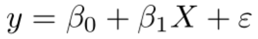

\newpage
\tableofcontents 
\listoftables 
\listoffigures 
\newpage

```{r setup, include=FALSE}
# Set your working directory

# Load your packages

library(tidyverse)
library(corrplot)
library(knitr)

#Build theme
mytheme <- theme_linedraw(base_size = 10) +
  theme(axis.text = element_text(color = "rosybrown"), 
        legend.position = "bottom")

#Set as default theme
theme_set(mytheme)

#Load data

company_selection_clean <- read.csv("./Data/Processed/Company_Selection_Clean.csv")

Reporting_inconsistencies_processed <- read.csv("./Data/Processed/Reporting_inconsistencies_processed.csv")

Energy_Usage_Clean <- read.csv("./Data/Processed/Energy_Usage_Clean.csv")

#Join datasets 

company_profiles <- left_join(company_selection_clean, Reporting_inconsistencies_processed)

company_profiles <- left_join(company_profiles, Energy_Usage_Clean)

#Filter out 1.0 ratios 

company_profiles2 <- company_profiles[!is.na(company_profiles$Company.report),]
  

```


# Rationale and Research Questions

As the world searches for climate change mitigation strategies in the face of apocalyptic climate projections and escalating real-world effects, the need to decarbonize the global economy has placed increasing societal and political pressure on companies to limit their emissions. Part of this pressure has come from the Environmental, Social, and Governance investing movement, which focuses on sustainability as a key part of identifying material risks and growth opportunities for companies. 

Corporations have responded to the decarbonization challenge posed by these external forces by self-disclosing their carbon footprints along with action plans for reducing them over a specified time horizon. However, there are 2 key issues with the self-disclosure model: 

*	Current emissions accounting and reporting practices have not been harmonized, leading to differential approaches to carbon accounting.

*	Given a lack of oversight in emissions reporting and the nature of informational asymmetries between organizations and investors, companies face perverse incentives to understate their carbon footprint and/or otherwise mischaracterize their progress toward decarbonization.

There have been recent efforts to address these issues. In March of 2022, the Securities and Exchange Commission (SEC) proposed rule amendments that would require companies to incorporate specific climate-related information in their statements and reports. This rule would also impose additional disclosure requirements on organizations that have made public commitments to take steps to address climate change. As part of their rationale for the proposed rule changes, the SEC noted both the need to harmonize disclosure standards and a desire to mitigate attempts by companies to engage in “green-washing” or “climate-washing”.

It is in this context that we sought to understand the extent to which companies might be engaged in green- or climate-washing, and whether organizations engaged in these behaviors possessed specific attributes that could reliably predict the propensity of such behavior. To investigate this, we reviewed a partial dataset from the Carbon Disclosure Project (CDP), which is a nonprofit that manages a global carbon emissions disclosure system. As CDP data is paywalled, we were able to access this partial dataset via a study published in *Nature Communications* (*Nature*) (Klaaßen & Stoll). This dataset and its attributes are described in greater detail in our Dataset Information section. 

Our primary research question was the following:

*	What attributes are the strongest predictors for emissions reporting discrepancies?

Over the course of our work, our dataset inspired an additional question:

*	What attributes are the strongest predictors for an organization’s total energy consumption?


\newpage

# Dataset Information

## Data Retrieval 

For this analysis, we used data analyzed in a *Nature* study that took data from 2019 CDP reports. CDP, a carbon footprint registry for companies and municipalities, conducts an in-depth questionnaire that inquires about the details of what entities do and don’t include in their carbon emissions reporting. The *Nature* study compared what technology companies published in their official company reports to what companies reported in CDP questionnaires and found technology companies often under reported emissions in official company reports. The data from nature came in the form of an Excel Workbook with many panels. We converted three panels into CSVs for analysis in R:

* Company information 
* Emissions predictors
* Reporting inconsistencies 

Table 1: Data Information

**Detail**           | **Description**
---------------------| -------------
Data Source          | Nature Communications
Retrieved from       | https://www.nature.com/articles/s41467-021-26349-x
Variables Used       | Company, Sales, Profits, Assets, Market value, Company report, CDP emissions, Emission reports deviation, Reporting inconsistency ratio, Total energy consumption 
Data Collection Year | 2019


## Data Wrangling

We processed our data by selecting relevant columns in each panel. These are described below:

### Company Information

For this panel, we began by identifying and slicing relevant rows of information pertaining to corporations of interest. We then selected columns with relevant attributes, and renamed them like so: Company, Industry, Country, Sales, Profits, Assets, Market Value, CDP Score 2019. Next, we converted column values to numeric data by removing special characters and changing the variable class. 

### Emissions Predictors

For this panel, we began by isolating values of interest. We sliced relevant rows, then selected columns with relevant attributes Next, we transposed the data so that each row contained consumption data for a specific company. We renamed the resulting columns Company and Total energy consumption. Finally, we removed special characters and converted column values to numeric data.

### Reporting Inconsistencies

For this panel, we again selected and filtered a specific variable of interest, in this case the difference between publicly reported emissions and emissions reported to CDP. We then transposed the data and renamed columns Company, Company.report, CDP, and Deviation. We substituted “na”s for missing data, then removed special characters and converted existing data to numeric. Finally, we created a new column, populated by variables, derived from dividing the Deviation value by the CDP value. We named this column Inconsistency Ratio.

Once our individual datasets were processed, we combined them into a single dataframe. To accomplish this, we created a new dataframe named company_profiles by left joining the Company Information dataset with the Reporting Inconsistencies datset. We then left joined the Emissions Predictors dataset to this new company_profiles dataframe. To assist our analysis, we concluded by filtering out ratios equal to 1 by dropping “na”s. 

\newpage

# Exploratory Analysis 

We reviewed our dataset and identified the top offenders by inconsistency ratio. The top 5 are shown here:

```{r top5, echo=FALSE}
top5 <- company_profiles2 %>% 
  slice_max(Inconsistency_ratio, n = 5) %>%
  select(Company, Inconsistency_ratio)

kable(top5, caption = "Top 5 Companies by Highest Reporting Inconsistency Ratio", align = 'l')
```


\newpage

# Analysis


## Question 1: What attributes are the strongest predictors for emissions reporting discrepancies?

To answer this question, we leveraged a linear model:




Our outcome of interest was the Inconsistency Ratio derived as part of our wrangling process. Our explanatory variables were Sales, Profits, Assets, and Market Value. These were regressed against our outcome variable. We did not find any statistically significant relationship between these variables and the outcome of interest.

## Question 2: What attributes are the strongest predictors for an organization’s total energy consumption?

To answer this question, we leveraged the same methodology described in our first question, with the only change occuring to our outcome of interest. This new outcome of interest was total energy consumption (MWh). Assets turned out to be the attribute that could predict total energy consumption with the highest degree of statistical confidence. This statistic is shown here:

```{r}

```


\newpage

# Summary and Conclusions

We did not find a statistically significant relationship between companies’ reporting discrepancy ratios and variables that indicate size. As expected, we found a relationship between total energy consumption and size indicators. But surprisingly the indicator with the most confidence was value of assets. 

```{r plot1, echo=FALSE, message=FALSE, warning=FALSE, fig.cap="Relationship between asset value and total energy consumption"}

options(scipen=5) 

Plot1 <- ggplot(company_profiles2, aes(x = Assets, y = Total.energy.consumption)) +
  geom_point() +
  geom_smooth(method = "lm", se = FALSE) +
  scale_x_log10() +
  scale_y_log10() +
  labs(x = "Value of assets (in millions)", y = "Total energy consumption (MWh)")
print(Plot1)

```

Our assumption that “big tech” would show more reporting discrepancies was not borne out in the data we analyzed. In future analyses on this topic, we would ideally have access to more CDP reports and more corporate reports in order to have a sample size that allows for more statistically accuracy. 

\newpage

# References

Klaaßen, Lena and Stoll, Christian. “Harmonizing Corporate Carbon Footprints.” Nature News, Nature Publishing Group, 22 Oct. 2021, https://www.nature.com/articles/s41467-021-26349-x. 